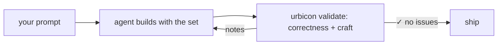

<p align="center">
  <a href="https://ui.urbicon.de">
    
  </a>
</p>

<p align="center">
  <a href="https://github.com/urbicon/ui/actions/workflows/ci.yml"></a>
  <a href="https://www.npmjs.com/package/@urbicon-ui/blocks"></a>
  <a href="LICENSE"></a>
</p>

<p align="center">
  <a href="https://ui.urbicon.de">Documentation</a> ·
  <a href="https://ui.urbicon.de/blocks">Components</a> ·
  <a href="https://ui.urbicon.de/getting-started">Getting started</a> ·
  <a href="https://ui.urbicon.de/changelog">Changelog</a>
</p>

---

**Urbicon UI** is a Svelte 5 + Tailwind CSS 4 component platform with **zero runtime
dependencies**. It started as one table component for Svelte 5 and grew into close to a hundred:
UI primitives, a data grid, auth, i18n and an AI-native toolchain, versioned and shipped as one
set. Nothing lands in your `node_modules` but the library itself. The charts and the Sankey
diagram draw without d3, the table virtualises its own rows, auth signs JWTs and verifies passkeys
on the Web Crypto API, and the variant engine is ours instead of `tailwind-variants`.

**Why another UI library?** A model can emit a whole app in one shot, markup and theming included.
The context balloons, the parts drift, and in the end neither a person nor the next model can read
the code. A component library abstracts exactly that noise away. What is left is structure and a
theme: readable, and changeable in one consistent place, for people and agents alike.

In practice, that means:

- **One system.** Components, docs and the design knowledge share a single version.
- **Every component speaks the same API.** The same `intent` / `size` / `variant` props, plus
  `unstyled` + `slotClasses` + `preset` everywhere you need to take over the styling.
- **It checks the code built with it.** `urbicon validate` scores what you or an agent writes on
  correctness and craft, and runs as a local CLI, a PostToolUse hook, or in CI.

## See it

Every pixel of the [documentation site](https://ui.urbicon.de), landing included, is built from
the library itself.

| | |
| --- | --- |
|  |  |
| The landing: a back-office dashboard composed from charts, controls and tokens, in one container-adaptive card. | The [specimen book](https://ui.urbicon.de/blocks): the complete set as living specimens, every cell the real component, each linked to its props, variants and playground. |
|  |  |
| An agent writes a component and `urbicon validate` scores it; the source view then shows the very file, verbatim. Readable code is the point. | Install · Ask · Ship: the prompt asks for *neon-magenta*, and the shipped page **is** that magenta. |

## Quick start

In a SvelteKit app the [`sv` add-on](https://www.npmjs.com/package/@urbicon-ui/sv) (beta) does the
whole setup (packages, Tailwind, the stylesheet import), from an empty directory or inside an
existing app:

```bash
bunx sv create my-app --add @urbicon-ui   # new project
bunx sv add @urbicon-ui                   # existing project
```

By hand it is one install and two imports for blocks — one more per further package. That path
needs no SvelteKit, just Svelte 5 with Vite and Tailwind 4:

```bash
bun add @urbicon-ui/blocks   # or npm/pnpm, whichever you use
```

```css
/* app.css */
@import 'tailwindcss';
@import '@urbicon-ui/blocks/style/index.css';
```

Every further `@urbicon-ui/*` package that ships components ships a stylesheet of its own — import it after blocks. Without it, the classes only that package uses compile to nothing, and nothing reports it. `bunx urbicon init` prints the import list for what is in `node_modules`.

```svelte
<script>
  import { Badge, Button, Input } from '@urbicon-ui/blocks';

  let name = $state('');
  let greeted = $state(false);
</script>

<Input label="Your name" bind:value={name} placeholder="Ada" />
<Button intent="primary" onclick={() => (greeted = true)} disabled={!name}>Say hello</Button>

{#if greeted && name}
  <Badge intent="success">Hello {name}!</Badge>
{/if}
```

The [getting-started guide](https://ui.urbicon.de/getting-started) walks through the Tailwind 4
setup and the first real page.

## What's in the box

| Package | What it gives you |
| --- | --- |
| [`@urbicon-ui/blocks`](https://ui.urbicon.de/blocks) | 80+ primitives and components (forms, overlays, charts, chat/AI surfaces), plus OKLCH tokens, the `tv()` variant engine and 300+ icons |
| [`@urbicon-ui/table`](https://ui.urbicon.de/table) | The data grid: sorting, grouping, selection, keyboard nav, virtual rows, remote data, live updates |
| [`@urbicon-ui/auth`](https://ui.urbicon.de/auth) | Sessions, refresh rotation, passkeys/WebAuthn, notifications, email; Web Crypto only, adapter-based |
| [`@urbicon-ui/i18n`](https://ui.urbicon.de/i18n) | Runes-based localisation with a data-level translation audit |
| [`@urbicon-ui/design`](https://ui.urbicon.de/ai) | The `urbicon` CLI: design knowledge, `urbicon validate`, `urbicon init` onboarding |
| `@urbicon-ui/sveltekit-utils` | URL-state runes, cron runner and other SvelteKit helpers |
| [`@urbicon-ui/sv`](https://www.npmjs.com/package/@urbicon-ui/sv) | The Svelte CLI add-on (beta, SvelteKit only): `sv add @urbicon-ui` installs the library and wires the stylesheet |

One version across all packages; supporting packages (`design-engine`, `docs-gen`, …) live in the
same repo and release in lockstep.

## Built for agents, readable by humans

The library treats AI coding agents as first-class consumers without giving up on the people who
review their work. `bunx urbicon init` writes the AGENTS.md block and scaffolds the design
manifest; add `--hook` and every edit runs through the gate on its way in:



Because components carry their design knowledge with them (per-component `llms.txt`,
machine-readable catalogs, a version-pinned CLI serving tokens, patterns and recipes), the agent
composes from the system instead of improvising against it. The result stays small and legible:
semantic tokens instead of pixel soup, one API grammar instead of per-component dialects.

One measurement, so you can size the claim. Haiku 4.5 built the same three-page app twice, once
reading the installed package on its own and once with the CLI and gate wired in. On its own it
shipped 373 linter findings, mostly raw Tailwind colours and hand-written `dark:` overrides;
wired, `urbicon validate` came out clean. The design itself scored alike either way. This buys
token discipline, not taste.

## Theming

The whole chassis re-tints from one `@theme` block, colour and typography together:

```css
/* app.css */
@import 'tailwindcss';
@import '@urbicon-ui/blocks/style/index.css';

@theme {
  --color-primary-500: oklch(0.7 0.31 330); /* every component follows */
}
```

Dark mode is `light-dark()` + `color-scheme`: no `dark:` variants, no flash, and it follows the
OS. See [customization](https://ui.urbicon.de/customization).

## Developing this repo

Bun 1.1+ workspace; Node 18+ for tooling.

```bash
bun install
bun run dev        # all packages in watch mode
bun run build      # build packages and apps
bun run test       # unit tests · bun run test:e2e for Playwright
bun run check      # svelte-check across the tree
```

Start with [docs/ARCHITECTURE.md](docs/ARCHITECTURE.md) (§1 package map & build order, §2 the
token → markup path); [docs/README.md](docs/README.md) indexes the rest: component families,
API conventions, Svelte 5 patterns, conscious trade-offs. Repository guidelines for agents and
contributors live in [AGENTS.md](AGENTS.md), the merge workflow in
[CONTRIBUTING.md](CONTRIBUTING.md).

Development happens on [GitHub](https://github.com/urbicon/ui);
[codeberg.org/urbicon/ui](https://codeberg.org/urbicon/ui) is a read-only mirror, which is what
the `Codeberg #NN` markers in the source refer to.

## License

[MIT](LICENSE) © Felix Urban
