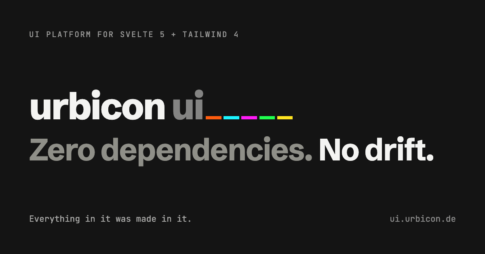
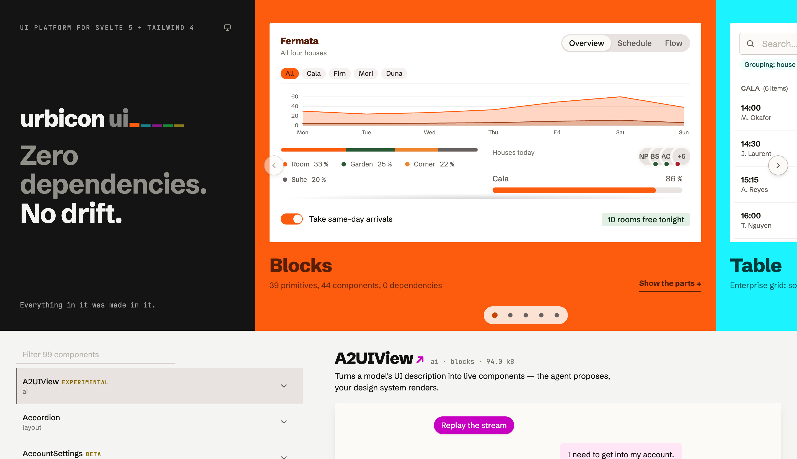
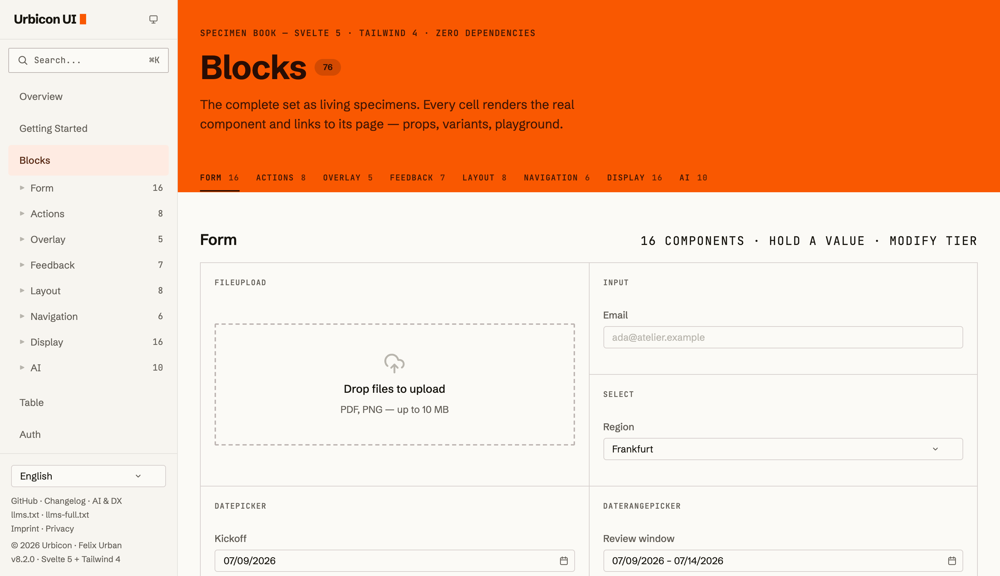
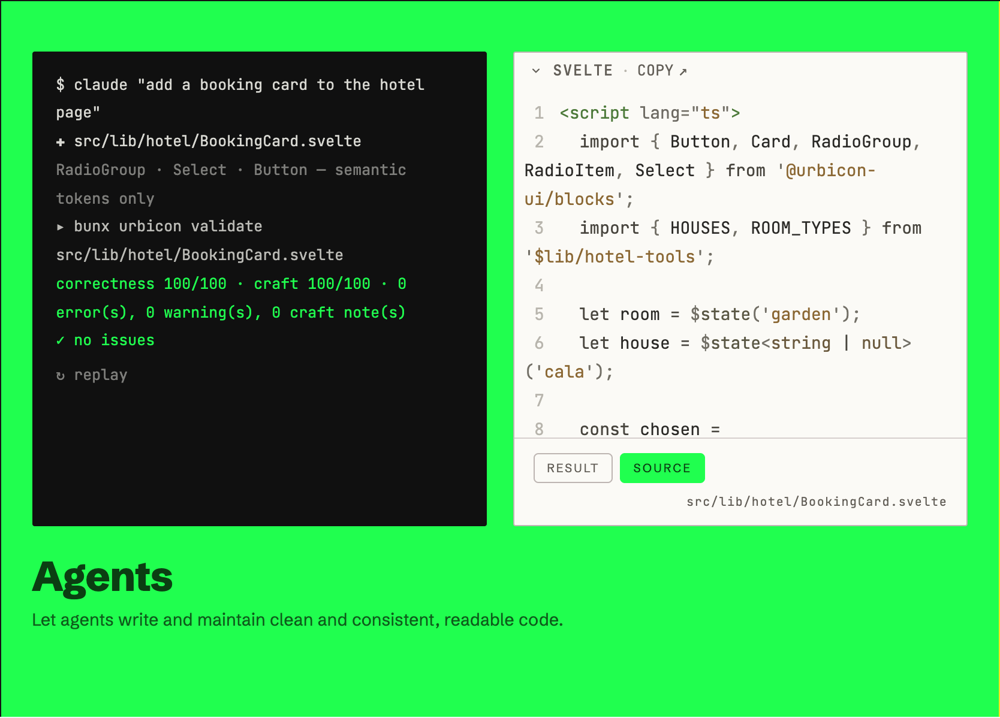
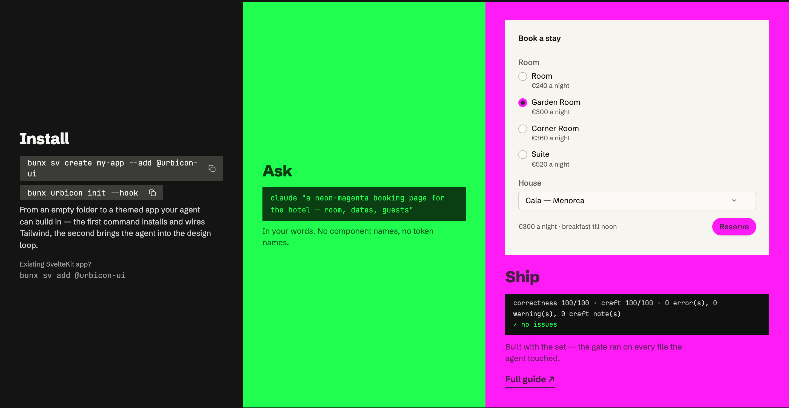
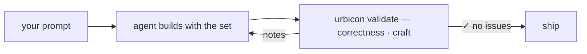

<p align="center">
  <a href="https://ui.urbicon.de">
    
  </a>
</p>

<p align="center">
  <a href="https://github.com/urbicon/ui/actions/workflows/ci.yml"></a>
  <a href="https://www.npmjs.com/package/@urbicon-ui/blocks"></a>
  <a href="LICENSE"></a>
</p>

<p align="center">
  <a href="https://ui.urbicon.de">Documentation</a> ·
  <a href="https://ui.urbicon.de/blocks">Components</a> ·
  <a href="https://ui.urbicon.de/getting-started">Getting started</a> ·
  <a href="https://ui.urbicon.de/changelog">Changelog</a>
</p>

---

**Urbicon UI** is a Svelte 5 + Tailwind CSS 4 component platform with **zero runtime
dependencies** — UI primitives, data grid, auth, i18n and an AI-native toolchain, versioned and
shipped as one coherent set. Nothing in your `node_modules` graph but the library itself: JWT,
passkeys and web push run on the Web Crypto API, the variant engine and the QR encoder are our
own, and dark mode is native CSS `light-dark()`.

The short version: **one package · one grammar · one gate.**

- **One package** — components, OKLCH design tokens, icons, docs and the design knowledge all
  ship in the set. Install it and you have the whole system, not a starting point.
- **One grammar** — every component speaks the same API: `intent` / `size` / `variant` axes, and
  `unstyled` + `slotClasses` + `preset` everywhere when you need to take over the styling.
- **One gate** — `urbicon validate` scores generated markup on two axes (correctness and craft)
  before it ships, as a local CLI, a PostToolUse hook, or CI. Agents build with the set; the gate
  keeps them honest.

## See it

Every pixel of the [documentation site](https://ui.urbicon.de) — landing included — is built
from the library itself.

| | |
| --- | --- |
|  |  |
| The landing: a back-office dashboard composed from charts, controls and tokens — one card, container-adaptive. | The [specimen book](https://ui.urbicon.de/blocks): 75 living specimens, every cell the real component, linked to props, variants and playground. |
|  |  |
| An agent writes a component, the gate scores it — and the source view shows the very file, verbatim. Readable code is the point. | Install · Ask · Ship: the prompt orders *neon-magenta*, and the shipped page **is** that magenta. Theming proven, not promised. |

## Quick start

```bash
bun add @urbicon-ui/blocks   # or npm/pnpm — the library doesn't care
```

```css
/* app.css */
@import 'tailwindcss';
@import '@urbicon-ui/blocks/style/index.css';
```

```svelte
<script>
  import { Badge, Button, Input } from '@urbicon-ui/blocks';

  let name = $state('');
  let greeted = $state(false);
</script>

<Input label="Your name" bind:value={name} placeholder="Ada" />
<Button intent="primary" onclick={() => (greeted = true)} disabled={!name}>Say hello</Button>

{#if greeted && name}
  <Badge intent="success">Hello {name}!</Badge>
{/if}
```

The [getting-started guide](https://ui.urbicon.de/getting-started) walks through the Tailwind 4
setup and the first real page.

## What's in the box

| Package | What it gives you |
| --- | --- |
| [`@urbicon-ui/blocks`](https://ui.urbicon.de/blocks) | 80+ primitives & components — forms, overlays, charts, chat/AI surfaces — plus OKLCH tokens, the `tv()` variant engine and 300+ icons |
| [`@urbicon-ui/table`](https://ui.urbicon.de/table) | The enterprise grid: sorting, grouping, selection, keyboard nav, virtual rows, remote data, live updates |
| [`@urbicon-ui/auth`](https://ui.urbicon.de/auth) | Sessions, refresh rotation, passkeys/WebAuthn, notifications, email — Web Crypto only, adapter-based |
| [`@urbicon-ui/i18n`](https://ui.urbicon.de/i18n) | Runes-based localisation with a data-level translation audit |
| [`@urbicon-ui/design`](https://ui.urbicon.de/ai) | The `urbicon` CLI: design knowledge, the validate gate, `urbicon init` onboarding |
| `@urbicon-ui/sveltekit-utils` | URL-state runes, cron runner and other SvelteKit helpers |

One version across all packages; supporting packages (`design-engine`, `docs-gen`, …) live in the
same repo and release in lockstep.

## Built for agents — readable by humans

The library treats AI coding agents as first-class consumers without giving up on the people who
review their work. `bunx urbicon init` writes the AGENTS.md block and installs the gate; from
then on the loop closes itself:



Because components carry their design knowledge with them — per-component `llms.txt`, machine-readable
catalogs, a version-pinned CLI serving tokens, patterns and recipes — the agent composes from the
system instead of improvising against it. The result stays small and legible: semantic tokens
instead of pixel soup, one API grammar instead of per-component dialects.

## Theming

The whole chassis re-tints from one `@theme` block — colour *and* typography:

```css
/* app.css */
@import 'tailwindcss';
@import '@urbicon-ui/blocks/style/index.css';

@theme {
  --color-primary-500: oklch(0.7 0.31 330); /* every component follows */
}
```

Dark mode is `light-dark()` + `color-scheme` — no `dark:` variants, no flash, follows the OS.
See [customization](https://ui.urbicon.de/customization).

## Developing this repo

Bun 1.1+ workspace; Node 18+ for tooling.

```bash
bun install
bun run dev        # all packages in watch mode
bun run build      # build packages and apps
bun run test       # unit tests · bun run test:e2e for Playwright
bun run check      # svelte-check across the tree
```

Start with [docs/ARCHITECTURE.md](docs/ARCHITECTURE.md) (§1 package map & build order, §2 the
token → markup path); [docs/README.md](docs/README.md) indexes the rest — component families,
API conventions, Svelte 5 patterns, conscious trade-offs. Repository guidelines for agents and
contributors live in [AGENTS.md](AGENTS.md), the merge workflow in
[CONTRIBUTING.md](CONTRIBUTING.md).

Development happens on [GitHub](https://github.com/urbicon/ui);
[codeberg.org/urbicon/ui](https://codeberg.org/urbicon/ui) is a read-only mirror, which is what
the `Codeberg #NN` markers in the source refer to.

## License

[MIT](LICENSE) © Felix Urban
