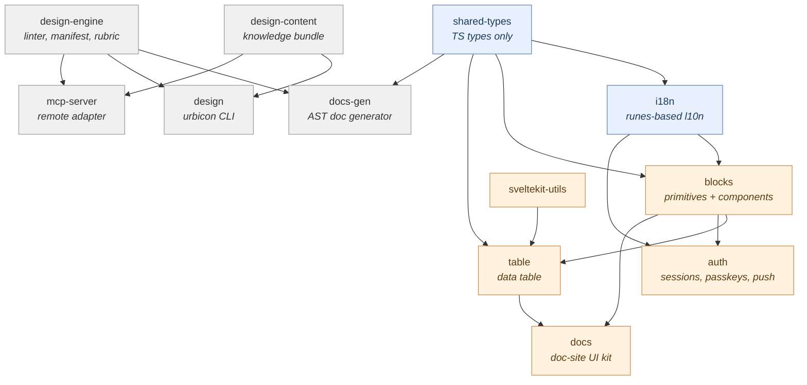
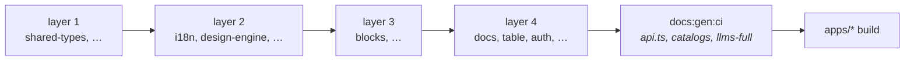
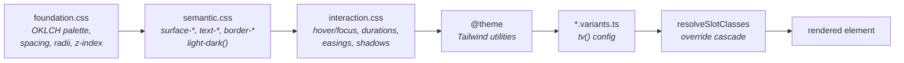
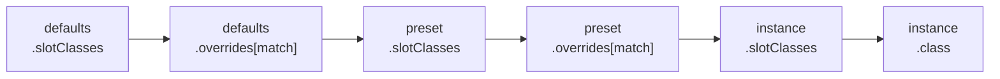
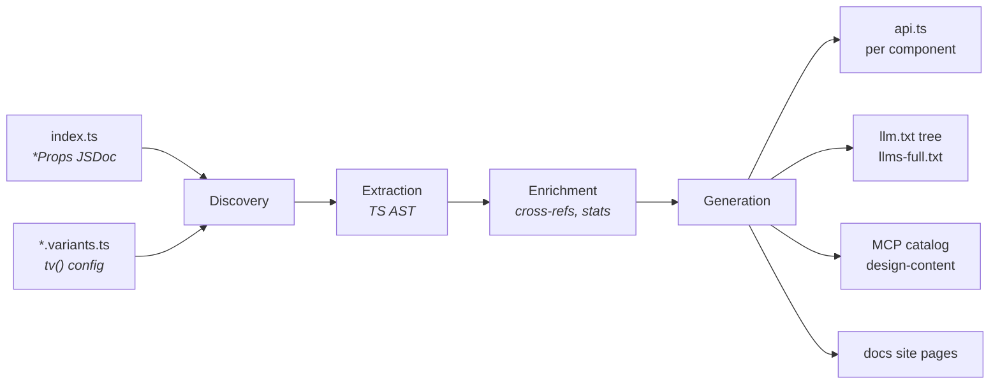

# Architecture

How the Urbicon UI monorepo is put together: which packages exist, how a component gets
from a design token to rendered markup, and which decisions are load-bearing.

**New here?** Read §1 for the map, then §2 for the one path that runs through everything
else. §3–§5 are reference — come back to them when you need them.

Deeper references this document links into rather than duplicating:
[COMPONENT-FAMILIES.md](COMPONENT-FAMILIES.md) (the taxonomy that drives ARIA, tier and
border decisions) · [COMPONENT-API-CONVENTIONS.md](COMPONENT-API-CONVENTIONS.md) (props and
callbacks) · [ComponentStructureStandard.md](ComponentStructureStandard.md) (file layout) ·
[DECISIONS.md](DECISIONS.md) (conscious trade-offs).

---

## 1 · The monorepo at a glance

Urbicon UI is a vertically integrated platform: UI primitives, a data table, auth, i18n,
documentation tooling and an AI-native developer surface, all under one version and with
**zero runtime dependencies** in every published package.

### The package map

Every arrow is a `peerDependency`, not a runtime dependency — each package's
`dependencies` field is literally `{}`. Consumers install what they use; the workspace
wires the same edges as `workspace:*` devDependencies for local development.



### What lives where

| Package | Does | Start reading at |
| --- | --- | --- |
| `shared-types` | Shared TypeScript types, no runtime code | `src/index.ts` |
| `i18n` | Runes-based localization + translation audit | `src/lib/i18n/registry.svelte.ts` |
| `blocks` | 40 primitives + 28 components, the token system, the `tv()` engine | `src/lib/index.ts` |
| `table` | Data table: sorting, filtering, grouping, selection, keyboard nav, virtualization, remote mode | `src/lib/stores/TableStore.svelte.ts` |
| `auth` | JWT sessions, refresh rotation, passkeys, Web Push, notifications | `src/lib/server/index.ts` |
| `sveltekit-utils` | SvelteKit helpers (`createCronRunner`, URL-state runes) | `src/lib/index.ts` |
| `docs` | Reusable documentation UI components | `src/lib/index.ts` |
| `docs-gen` | AST-based documentation generator (CLI) | `src/cli/index.ts` |
| `design-engine` | Zero-dep design linter, manifest parser, rubric | `src/linter/index.ts` |
| `design-content` | Versioned design-knowledge bundle (`content/` is a build artifact) | `src/content-loader.ts` |
| `design` | The `urbicon` CLI — the primary consumer-facing surface | `src/cli/index.ts` |
| `mcp-server` | Thin remote adapter over engine + content | `src/index.ts` |

Applications live in `apps/`: [`apps/docs`](../apps/docs/README.md) is the documentation
site. End-to-end suites live in `e2e/`.

### Build order

`bun run build:ts` (and `build:packages`, since 2026-08-12) runs
`scripts/build-packages.ts`, which derives **layered build order from the
`workspace:*` edges** between the packages — each layer builds in parallel,
the next starts only when the previous finished. A flat
`--filter='./packages/*'` sweep is not equivalent: it races the topology, and
a package that types against a not-yet-built neighbour (docs against blocks'
`VariantProps`, table against sveltekit-utils, …) gets its inferred exports
silently emitted as `any` — exit code 0, declaration file present, every
variant prop gone (measured 2026-07-31 and again 2026-08-12; details in the
script header).



(The concrete layers are derived, not hand-written — run the script to see
the current assignment.)

Two things bite in a fresh worktree:

- Run `bunx --bun svelte-kit sync` in `blocks` and `apps/docs` before `svelte-check` or
  `dev`.
- `apps/docs` needs both the built packages **and** a `docs:gen:all` run — every page
  imports a generated, git-ignored `./api.ts`.

---

## 2 · From token to markup

This is the single path every visible component in the library follows. Understanding it
once explains how all of them are styled.



### The three token layers

All in `packages/blocks/src/lib/style/`:

| Layer | File | Purpose |
| --- | --- | --- |
| Foundation | `foundation.css` | OKLCH colour palette, spacing, radii, z-index scale, breakpoints |
| Semantic | `semantic.css` | Context-aware tokens (`surface-*`, `text-*`, `border-*`) with automatic dark mode via the CSS `light-dark()` function |
| Interaction | `interaction.css` | Hover/focus/active states, duration tokens, easing tokens, shadow tokens |

Foundation defines raw values. Semantic maps them to UI purposes and handles light/dark
switching. Interaction defines motion and visual feedback.

All tokens are registered in Tailwind 4 `@theme` blocks, so they generate utility classes
automatically (`bg-surface-base`, `text-text-primary`). Dark mode needs **no `dark:`
overrides anywhere** — `light-dark()` follows `color-scheme`. Tailwind 4 specifics:
[TailwindCaveats.md](TailwindCaveats.md).

The surface ladder (`base` / `quiet` / `subtle` / `elevated` / `overlay`) and what each
container variant means is documented in the shipped
[variant contract](../packages/blocks/docs/VARIANT-CONTRACT.md).

### The tier system

Radius semantics follow a three-tier model. A component picks the tier whose *semantics*
match its purpose, never a fixed pixel value — so a brand can re-tune a tier's physical
radius without touching component code.

| Tier | Token | Purpose | Default geometry |
| --- | --- | --- | --- |
| `commit` | `--radius-commit` | Action surfaces — buttons, menu triggers, toolbar items, toggle tracks. Declares identity ("press me"). | Pill (`9999px`) |
| `modify` | `--radius-modify` | Tap surfaces — inputs, selects, checkboxes, tabs. Reads as editable, not as a commit-decision. | Soft (`var(--radius-sm)`) |
| `contain` | `--radius-contain` | Architectural surfaces — cards, dialogs, drawers, alerts, popovers, tooltips. Reads as a frame holding content. (`Sidebar` sits outside: a full-height panel flush to the viewport edge has no corner to turn.) | Subtle (`var(--radius-xs)`) |

**Defaults by family:** Action `commit` · Form `modify` · Container `contain` ·
Navigation per component. Feedback/Ambient (Toast, Spinner, Progress, Skeleton) and
Identity (Avatar) are **not** tier-aware — fixed geometry by design. Badge is the lone
Feedback exception. Full taxonomy: [COMPONENT-FAMILIES.md](COMPONENT-FAMILIES.md).

**One shape sits outside the tiers: `--radius-control`, the radio indicator.** It
defaults to the same pill as `commit` but is not tied to it, because the circle is the
only thing distinguishing a radio from a checkbox — both are otherwise the same small box
with the same label, and unlike a button's pill the circle is convention with meaning
(Material, HIG and Carbon all hold it). While the two shared a token, a brand taking this
section's own invitation to flatten `--radius-commit` squared its radios into things that
read as checkboxes; all four docs liveries needed a provider override to undo it, including
the one that only softens the tier to 2px. Set `--radius-control` if you want square radios
too — that is now a decision rather than a side effect.

The **checkbox** deliberately still follows the tier. It looks like the mirror case and is
not: a squared radio is damage a theme inflicts on a control it was not aiming at, whereas
a pill-shaped checkbox is what a consumer asked for by writing `tier="commit"` — the
status-chip look for checklists.

**Context propagation.** Tier-aware primitives read their effective tier from
`<TierContext>` (`utils/tier-context.ts`); a wrapping container sets it for all descendants:

```svelte
<Toolbar tier="modify">
  <Button />   <!-- now rounded-modify instead of the commit pill -->
  <Toggle />
</Toolbar>
```

```ts
const tierCtx = getTierContext();
const effectiveTier = $derived(tier ?? tierCtx?.tier ?? 'commit'); // or 'modify'
```

Per-instance `tier` beats context; context beats the family default.

**The bridge token.** `--radius-bridge` is the *middle* rung — 6px by default, living in
`foundation.css` — for the two cases where `contain` is too hard and `commit` too soft:

1. **Adjacency.** A floating panel anchored to a pill (`commit`) trigger sits between the pill
   edge and the `contain`-tier surface beneath — the `Menu` panel is the canonical case.
2. **Optical size.** Radius scales with the area it turns: 2px on a 600px Card reads as a
   precise edge, the same 2px on a ~200px tile reads as a plain rectangle. A small tinted
   surface is *content*, not architecture — the `ChatMessage` bubble, `Textarea` at
   `tier="commit"` (a pill would be absurd on a multi-line field), and `Card tier="bridge"`,
   which is how a consumer says "this tile is too small for the container radius" without
   hand-setting a `rounded-*` class and splitting the contain family.

Anything that genuinely *is* a panel, dialog or container stays on `contain`.

### The tv() variant engine

All variant logic runs through a **custom `tv()` engine**
(`packages/blocks/src/lib/utils/variants.ts`, ~600 LoC, zero-dependency replacement for
`tailwind-variants`). Each component has a `*.variants.ts` defining slots, variants, sizes,
intents, compound variants and defaults.

**The conflict resolver.** The pipeline is an ordered list of sources —
`slot-base → each variant axis in declaration order → each matching compoundVariant in
array order → call-site class` — folded sequentially: every later source **strips**
conflicting Tailwind utilities from everything before it.

So `slotClasses={{ box: 'rounded-full' }}` deterministically defeats a base `rounded-sm`,
and an active-state compound's `bg-neutral` defeats an outlined variant's `bg-transparent`.
**Axis and compound order are therefore semantic**: declare the axis that must win a shared
bucket later.

The resolver works on **bucket equality** — two classes conflict only if they normalize to
the same key (`bg-color`, `border-t-width`, `text-size`, `opacity`, …). Modifier prefixes
(`hover:`, `focus-visible:`, `md:`, `!`, negative sign) are part of the bucket key, so they
isolate naturally: `hover:bg-red` and `bg-blue` coexist. The modifier/base split is
bracket-aware, and arbitrary properties bucket per CSS property name (`[gap:inherit]` shares
the `gap` bucket; `[--spinner-speed:1s]` conflicts only with the same custom property).
Within a *single* class string nothing is stripped, so intentional pairings like
`rounded-md rounded-t-none` survive.

**Directional shorthand dominance** (a subset of `twMerge`'s map): a later shorthand strips
the longhands it fully covers — `p-0` defeats an earlier `px-4`/`pl-10`, `rounded-none`
defeats `rounded-t-*`, `inset-0` defeats `top-*`, `size-8` defeats `w-*`/`h-*`. The reverse
never strips: a later `pl-2` *refines* an earlier `p-4`.

**Fail-loud configs.** Slot-map keys are compile-checked against declared slots (a
`wrapeer` typo is a type error), and every config is validated once at module init —
unknown slot keys, unknown compound axes, undeclared `defaultVariants`, `base` + `slots`
together all **throw** with precise messages rather than degrading silently. Every resolver
exposes its config as `.config`, which is what `bun run variants:lint` replays over the
pairwise variant matrix to find dead tokens. The same run asks the Tailwind compiler which
properties it declares **for every class the library ships** and compares that against
`BUCKET_PATTERNS`, so a family the table has no pattern for — where both classes would
survive and the stylesheet's emit order would decide again — fails the build instead of
going quiet. The reach is the shipped classes, not Tailwind's whole namespace: a gap in a
family no component writes stays invisible until one does.

Coverage limits and why they are deliberate: [DECISIONS.md](DECISIONS.md#the-tv-engine-is-narrower-than-tailwind-variants).

### The override cascade

Consumers restyle components through one ordered chain, conflict-resolved per Tailwind
bucket so a later source always wins:



`slotClasses` (unconditional) and `presets` (opt-in, named) are registered on
`BlocksProvider`; a preset is consumed via the `preset` prop on any component:

```svelte
<BlocksProvider
  presets={{ Button: { overlay: { slotClasses: { base: 'bg-black/20 text-white' } } } }}
>
  <Button preset="overlay">Weiter</Button>
</BlocksProvider>
```

**Conditional `overrides`** target a specific variant/intent/state — what unconditional
`slotClasses` cannot express. Each entry is a `compoundVariant`-shaped matcher; on a match
its classes join the cascade and the resolver strips the library's conflicting class:

```svelte
<BlocksProvider defaults={{ Badge: { overrides: [{ variant: 'outlined', class: { base: 'border' } }] } }}>
  <!-- every outlined Badge gets a 1px border; filled / soft / dot untouched -->
</BlocksProvider>
```

Entries match active **prop values** (via `matchesCompound`), not the library's internal
variant structure — so it is irrelevant whether `border-2` lives in a `variant` or a
`compoundVariant`. `string` matches by equality, `string[]` as "one of"; multiple matching
entries merge additively.

Every component family resolves through the shared
`resolveSlotClasses(config, name, preset, activeProps, instanceSlotClasses)`, each feeding
its active `variantProps` as the match input — so `overrides` applies library-wide.

The name is not always the component's own. A **compound part** — `CalendarHeader`,
`LocaleSwitcher`, `MenuItem`, `CalendarDay` — renders only inside (or through) another
component and is addressed under *that* component's name: `defaults.Calendar.slotClasses`
reaches CalendarHeader's header, nav and title, and `defaults.Select` reaches
LocaleSwitcher, which forwards `unstyled` / `slotClasses` / `preset` verbatim to the
`<Select>` it wraps. An entry written under the part's own name matches no lookup and is
never read, with nothing reported — the same silence a misspelt component name buys.

Key files: `provider/BlocksProvider.svelte`, `provider/blocks-context.ts`,
`utils/variants.ts`. The consumer-facing override ladder ("reach for the lowest rung"):
[COMPONENT-API-CONVENTIONS.md § slotClasses](COMPONENT-API-CONVENTIONS.md#slotclasses).

### The internal core layer

Public components never import each other for trivial embedded controls — that made every
Badge ship Button's full variants matrix and every Button ship the whole Spinner (measured:
Badge −29 %, Dialog/Drawer −30 % gz after the extraction). Shared behaviour lives in
`src/lib/internal/core/` instead:

- **`CoreSpinner`** — the spinner arc (geometry shared with the public `Spinner` via
  `spinner-geometry.ts`) plus spin animation. No role/aria: the embedding context carries
  the semantics, and a `role="status"` here would nest live regions inside Toast.
- **`CoreIconButton`** — a behaviour-only native `<button>` (required `aria-label`, disabled
  inertness, focus-visible reset). Visual identity comes entirely from the call site's
  variants slot (`removeButton`, `closeButton`, `navButton`, …); the core runs no tv()/mint
  pass, so it stays a few hundred bytes.
- **`CoreFieldMessage`** — the helper/error line under a form field, shared by all ten
  Form-family components. It owns error-beats-helper precedence, `role="alert"` on the error
  arm only, and putting the right id on the right arm. The **label** is deliberately not
  extracted alongside it: `<label for>` vs `<span id>` behind `aria-labelledby` vs a nested
  label are dictated by how many focusable elements the field has, so unifying them would be
  an a11y regression.

Genuine compositions (ConfirmDialog = Dialog + Buttons, Menu → Popover, DatePicker →
Calendar, PaginationItem *is a* Button) remain public-to-public — the rule targets
fixed-configuration utility embeds, not essence. `bun run imports:lint` enforces the
boundary: every cross-component edge needs a justified allowlist entry, and stale entries
error too, so the list only shrinks deliberately. Nothing under `internal/` is exported or
documented.

---

## 3 · Cross-cutting systems

### Form-field wiring

Every form primitive (Input, Textarea, Select, Combobox, Checkbox, Toggle, RadioGroup,
Slider) routes its ARIA wiring through one hook in
`packages/blocks/src/lib/utils/use-form-field.svelte.ts`:

```ts
const propsId = $props.id();
const ff = useFormField(() => ({
  fieldId: idProp ?? `prefix-${propsId}`,
  hint: helper,
  error,
  required,
  disabled
}));
```

```svelte
<input id={ff.fieldId} aria-invalid={ff.invalid ? 'true' : undefined} aria-describedby={ff.describedBy} />
{#if ff.errorId}<div id={ff.errorId} role="alert">{error}</div>
{:else if ff.hintId}<div id={ff.hintId}>{helper}</div>{/if}
```

The hook derives `errorId`, `hintId`, `describedBy` (error-first), `invalid`, plus
pass-through `required`/`disabled`. Hint and error are mutually exclusive — an error
suppresses the hint (Material / Carbon / Polaris convention). `fieldId` is supplied by the
caller because `$props.id()` is only valid at component top level; routing it through the
hook input keeps the hook runnable from tests.

Pure logic lives in `computeFormFieldAria()` and is unit-tested directly; the reactive
wrapper is one line of `$derived` glue. The standalone `<FormField>` uses the same hook.

### Mint (micro-interactions)

`packages/blocks/src/lib/mint/` provides opt-in micro-interactions.

- **Effects:** `scale`, `translate`, `rotate`, `glow`, `pulse`, `wiggle` (hover), `bounce`,
  `shake`, `ripple` (click) — composable via array; `composite` bundles several. `BUILTIN_MINT_NAMES`
  is the single runtime list; the `MintName` union derives from it.
- **Two behaviour models:** hover/focus **hold** the effect while the pointer (or visible
  focus) stays on the element; click/load run it once and settle on the effect's own end
  event. Held hover requires `(hover: hover)` — touch devices never stick.
- **No setup required:** unknown names demand-load the built-in set on first use;
  `registerDefaultMints()` at startup remains available for first-interaction guarantees.
- **Config is real:** `duration`/`easing`/`intensity` become per-effect inline custom
  properties (`--blocks-mint-<effect>-duration/-easing`) the stylesheet reads with the theme
  tokens as fallback.
- **Accessibility:** respects `prefers-reduced-motion` automatically
- **Usage:** `<Button mint="scale">` or `<Card mint={['scale', 'ripple']}>`

All effects share one stylesheet (`mint/styles.css`, imported once by `style/index.css`).
Components apply the `blocks-mint-*` class on the affected element and never inline the
keyframes, which keeps specificity uniform: a single `.blocks-mint-scale` rule wins in
source order and consumer overrides don't have to fight per-component duplicates.

The `glow` effect reads its colour from `--blocks-mint-glow-color`, set by **intent hooks**
on the root element:

| Hook class | Resolves to |
| --- | --- |
| `.blocks-intent-primary` | `color-mix(var(--color-primary) 50%, transparent)` |
| `.blocks-intent-secondary` | `color-mix(var(--color-secondary) 50%, transparent)` |
| `.blocks-intent-success` | `color-mix(var(--color-success) 50%, transparent)` |
| `.blocks-intent-warning` | `color-mix(var(--color-warning) 50%, transparent)` |
| `.blocks-intent-danger` | `color-mix(var(--color-danger) 50%, transparent)` |
| `.blocks-intent-neutral` | `color-mix(var(--color-neutral) 40%, transparent)` |
| *no hook* | primary (the `:root` default) |

Components that propagate `intent` to their root attach the matching class; the glow picks
up the right colour via the cascade with no per-component `box-shadow`. **Do not** redefine
`--blocks-mint-glow-color` in component-local variants — that re-introduces the duplication
these central tokens replaced.

### Overlay motion

The **modal/panel overlays** (Dialog, Drawer, ConfirmDialog, Toast) share one
Svelte-transition-driven contract. Tokens live in `style/interaction.css`, mirrored as JS
constants in `utils/overlay-tokens.ts`:

| Custom property | Default | Purpose |
| --- | --- | --- |
| `--blocks-overlay-enter-duration` | `200ms` | Panel enter |
| `--blocks-overlay-exit-duration` | `180ms` | Panel exit |
| `--blocks-overlay-backdrop-enter-duration` | `200ms` | Backdrop fade-in |
| `--blocks-overlay-backdrop-exit-duration` | `180ms` | Backdrop fade-out |
| `--blocks-overlay-easing` | `cubic-bezier(0.83, 0, 0.17, 1)` | Shared easing |
| `--blocks-overlay-panel-scale-start` | `0.96` | Scale-in start (1 disables) |
| `--blocks-overlay-panel-fly-distance` | `320px` | Fly-in distance along the placement axis |
| `--blocks-overlay-backdrop-blur` | `8px` | Backdrop `backdrop-filter` (Dialog, Drawer, Sidebar) |

`prefers-reduced-motion: reduce` collapses every duration to `1ms`, scale to `1` and
fly-distance to `0px` in a single media-query block — components never check the query
themselves.

Svelte transitions need numeric inputs, so components call `getOverlayMotion(override?)`
rather than hard-coding numbers. It resolves the live CSS values via `getComputedStyle`,
parses ms/s/px, and falls back to the JS defaults on the server.

### Press cue

One more motion token sits outside that family, in the same file:

| Custom property | Default | Purpose |
| --- | --- | --- |
| `--blocks-press-scale` | `0.98` | How far a held control dips (`1` disables) |

Read by Button (its `active:` cue and its modelled `pressed` state), Badge's remove
control and the Drawer / Dialog close buttons — the same ghost-Button fold. Three things
set it: the theme, the reduced-motion block (to `1`, alongside the overlay scale), and
Button itself, which writes `1` on an element whose `mint` is off so `mint="none"` also
means "does not move". Only the movement goes either way; the paired `active:shadow-*`
step keeps reporting the press, which matters on the flat variants that have no fill to
darken. Interactive Badge/Avatar (`0.95`) and Table rows (`0.995`) are separate gestures
and stay literals.

The **anchored, native-popover surfaces** deliberately do *not* run Svelte transitions —
their show/hide is owned by `showPopover()`/`hidePopover()` and native light dismiss, which
no JS transition can animate. They run CSS-native motion on faster token pairs, both
defaulting through `--blocks-duration-fast`:

- **Tooltip** — `--blocks-tooltip-duration` / `-easing`, opacity fade.
- **Popover** (and Menu / DatePicker through it) — `--blocks-popover-duration` / `-easing`,
  fade + scale. `@starting-style` supplies the enter before-state,
  `transition-behavior: allow-discrete` on `display`/`overlay` keeps the exit painted
  through the native hide, and the component lags its children-teardown to the computed
  duration. The panel stamps `data-state="open" | "closed"` as the styling hook.

**Don't** hard-code 200/250 ms or panel-scale numbers in a new overlay. A new modal overlay
picks up the `--blocks-overlay-*` tokens; a new anchored surface follows the Popover
mechanism. In neither case mint parallel tokens.

### i18n

Runes-based internationalization in `packages/i18n/`, re-exported through `blocks`.

- **SSR-correct:** the active locale lives in a request-scoped **context**
  (`<I18nProvider>` / `provideI18n`), not a module-global singleton — concurrent SSR
  requests with different locales don't leak. Static translation data stays module-global.
- **Package-based:** each package registers its own namespaced keys via `createPackageI18n`
  and exports a `use<Package>I18n()` hook.
- **Read-tolerant, write-strict:** reading without a provider resolves the base locale
  (`en`, SSR-safe); `setLocale` without a provider throws.
- **Type-safe:** literal key + param inference through the generic factory — typos are
  compile errors.
- **Authored as TS `as const`**, not JSON, so literal types flow into inference with no
  codegen step.
- **Plurals via `Intl.PluralRules`** (per-locale CLDR categories, cached), not a bundled
  ICU runtime.
- **Code-splitting:** non-base locales register as dynamic-import loaders. **blocks ships
  this way** — `en` eager, `de` lazy — so English-only apps don't bundle the `de` catalog.
  Because the provider loads lazy chunks in a client-only `$effect`, a server-rendered
  non-base app renders the fallback until hydration; register the bundle eagerly at server
  start to make it SSR-present.
- **Translation audit:** data-level `auditTranslations` plus a dev-only
  `@urbicon-ui/i18n/audit` source scanner, fronted by `urbicon i18n` and `bun run i18n:check`.

The deliberate trade-off: a **runtime registry** (not a Paraglide-style compiler) keeps
translations reactive and SSR-context-scoped at the cost of full tree-shaking — acceptable
for a component library where locale data is small.

Locales: `en`, `de` (data); `fr`/`es`/`it`/`nl` declared. Server-side resolution via
`resolveLocale(request)`. Full reference: [`packages/i18n/README.md`](../packages/i18n/README.md).

### Date & planning infrastructure

Calendar, `Planner<T>` and `ResourceTimeline<T>` share a headless date-grid core.
`packages/blocks/src/lib/internal/date-grid/` holds the `DateGridController`, its context,
the keyboard model, the span packer and `DateGridScaffold` — deliberately **not** exported:
three in-repo consumers don't yet justify the API-stability cost, and a re-export is a
one-line `package.json` change if that ever shifts.

Pure date math lives in `packages/blocks/src/lib/date/` (`geometry`, `range`, `compare`,
`format`) and **is** public via the `./date` subpath export.

`Planner<T>` is the generic planning-board component built on that core — event type is
caller-supplied (`T`, not a fixed `CalendarEvent`), view-parametrised. Calendar keeps its
own month-view rendering by design: the scaffold owns time-grid mechanics, not month-grid
layout.

`ResourceTimeline<T>` is the third consumer and the one with a second axis: one lane per
resource against a day window, items drawn as bars over an inclusive `[start, end]` day
range. It takes the controller's navigation, bounds and today handling but **not**
`DateGridScaffold` or `handleDateGridKeydown` — that grid's vertical axis is the week
(`ArrowUp` = −7 days), and here it is the lane, so the two keyboard models cannot be
merged. What it does share is `pack-spans.ts`, the greedy first-fit row packer lifted out
of `calendar.engine.ts`: one packer now stacks both Calendar's month bars and the
timeline's lane bars.

**The facades share a vocabulary, not just an engine** (#191, 2026-08-12). Two public
types live in `date-grid.types.ts` and are re-exported by every surface that speaks them:
`DateRange` (the inclusive start/end pair) and `DateCategory` (the colour bucket behind
bars, dots and legends). They replaced six twins — `DateGridRange`, Calendar's
`DateRange`, `PlannerRange` and an inline `{ start; end }` on the one side,
`CalendarEventCategory` and `TimelineCategory` on the other — differing in which component
had declared them and, on Calendar's category, in an `icon` no legend ever rendered;
moving categories from a Calendar to a Timeline mapped a type onto itself. The `icon` did
not survive the merge rather than spreading to a second surface.

The small toolbar twinned the same way — 35 lines of markup in each of the two headers,
plus four byte-identical `tv()` slots and their three size steps — and is now
one internal core (`CoreDateGridHeader`) over one shared slot table
(`internal/core/date-grid-header-slots.ts`), spread into each surface's own `tv()` config
so the slots stay part of its public `slotClasses`. `CalendarHeader` stays its own: it
carries a month picker, a view switcher and a narrow-viewport grid, names its title slot
`title` rather than `headerTitle`, and resolves slots with a second `extra` argument the
core's resolver does not take.

What is deliberately **not** unified is the data vocabulary: `events`/`CalendarEvent`,
`items`/`getDate`, `items`/`getResourceId`+`getRange`. Those differ because the data models
do (see [COMPONENT-DECISION-MATRICES.md](COMPONENT-DECISION-MATRICES.md) → Date Surfaces),
and the accessor props are what carries one array onto a second surface without a
conversion step.

---

## 4 · The packages in profile

Each package's own README is the authoritative reference; these are orientation notes.

### `blocks`

40 primitives and 28 components, the token system, the `tv()` engine, the Mint system, the
icon set (358 icons) and the provider. Everything in §2 lives here.

Icons are tree-shaking-sensitive: **never call `getIcon('name')` inside a component** — the
dynamic key drags the whole set into the consumer bundle. Use `resolveIcon('name', NameIconDefault)`
with a direct import (`<Icon name="…" />` is the lone exception). See
[ICON-DESIGN.md](ICON-DESIGN.md).

### `table`

Feature-rich data table: smart filtering, grouping, summaries, search highlighting, column
visibility and reordering, persistence, virtualization, live updates, and responsive
desktop/mobile views.

All data processing is a reactive `$derived` chain in `TableStore.svelte.ts`:

```
items → filteredItems → sortedItems → grouped → paginatedItems
```

Each stage depends on the previous one plus the relevant state (search term, active
filters, sort column, group key, page).

**View state (v8).** The six axes that decide *which* rows are shown — search, sort, page,
pageSize, filters, groupBy — live in one consumer-constructed `TableView` under a single
name scheme, resolved against its `defaults` at construction (SSR-safe, no effects). Where
they live is decided by bindings applied to that object, not by props of the table:
`bindViewToUrl` (in `sveltekit-utils`, needs `$app`) and `bindViewToStorage` (here,
Kit-free). Precedence comes from phases, not from registration order: defaults → URL (at
init, synchronously, SSR included) → storage (after hydration); at runtime only the URL
applies, storage only writes, and an axis is stored when its last change came from the
reader. Preferences (column visibility and order, summaries, opt-in selection) are a
separate channel — the `prefs` prop — and never enter the URL.

**Who processes the rows.** The data source is one union (`source`), and every variant
carries a `processing` tag: `{ processing: 'client', items, … }` when the table sorts,
filters and pages in the browser, `{ processing: 'server', items, total, … }` when your
backend does that work and you fetch each page, `{ processing: 'server', query }` when it
does that work and the table drives the fetch. The tag is required on all three because it
decides where the reader's sort headers act; the invalid combinations of the old
`mode`/`queryFn`/`loading` props are not expressible. In server mode the derived chain passes `state.items` through unchanged and
`totalPages` comes from the source's `total`. The managed path fetches, aborts superseded
requests and owns loading/error; `observeView(view, cb)` is the observer channel for
consumers who want view changes without a URL.

**How the rows render.** Two layouts behind one container query (the `cardsBelow` axis):
the desktop grid, and below the step a card list — a container query, not a media query, so
a table in a narrow column gets cards without the page being narrow. The desktop grid is a
single `<table>`: one `<colgroup>` sizes the tracks once for the header, the rows and the
totals, which render as a `<tfoot>`. Virtualization keeps that shape — the same one table
inside a scroll box of `virtualHeight`, the rendered window carried by two `aria-hidden`
spacer rows, `<thead>` and `<tfoot>` pinned to the box's edges. It was three independent
tables until v8.10.0, and that cost three column models: a reserved scrollbar gutter
narrowed only the body, so every proportional column drifted against its header.

Scroll models (page-relative sticky pinning vs. contained scroll):
[STICKY-PINNING.md](STICKY-PINNING.md). Upgrading from v7:
[MIGRATION-V8.md](MIGRATION-V8.md).

### `auth`

Zero-runtime-dependency authentication, user management and notifications for SvelteKit —
all crypto via the Web Crypto API.

**Server** (`@urbicon-ui/auth/server`): JWT (HMAC-SHA256), PBKDF2 hashing, CSRF,
rate-limiting, security headers; handler factories for login/logout/register/
forgot-reset-password/verify-email/refresh; `createAuthHandle()` for session hydration,
route guards and transparent refresh-token rotation (15-min access + 30-day rotating
refresh cookies, token families, reuse detection); WebAuthn/passkeys (CBOR decoder, ECDSA
P-256 + RSA, FIDO2 Level 2); Web Push (ECDH + HKDF + AES-128-GCM, RFC 8291/8292/8188, VAPID
signing); an adapter pattern for repositories with a Prisma adapter shipped; pluggable
stores for challenges, rate limits and refresh tokens.

**Client** (`@urbicon-ui/auth`): 14 blocks-based UI components, Svelte 5 runes stores
(`createAuthStore()`, `createNotificationStore()`), service-worker helpers.

Full reference incl. consumer integration and known security limitations:
[AUTH.md](AUTH.md).

### `docs-gen`

See §5.

### `design`, `design-content`, `design-engine`

The `urbicon` CLI is the **primary consumer-facing surface** — one dev-dependency with
version-pinned knowledge. Knowledge commands: `primer` (run first), `find`, `get-component`,
`icons`, `recipe`, `guide`, `pattern`, `principles`, `css-reference`. Judgment: `validate`
(+ `hook`/CI). Memory: `context`, `record-decision`, `sync-manifest`. Process: `verbs` and
the `urbicon-design` skill. Onboarding: `init`.

`design-engine` is the zero-dep linter, manifest parser and rubric; `design-content` is the
versioned knowledge bundle both the CLI and the MCP server read. `mcp-server` is a thin
remote adapter over the same two — [deliberately unhosted](DECISIONS.md#the-mcp-server-is-built-green-and-not-hosted).

---

## 5 · Tooling & pipelines

### The docs-gen pipeline

AST-based extraction of component metadata into every documentation channel. The `*Props`
JSDoc in each `index.ts` is the single source of truth.



**Program-backed extraction.** Every `ConfigurationFactory` preset carries
`input.typescript.configPath`; a shared `ts.Program` per package resolves imported props
bases (`extends Omit<InputProps, …>`), type-only imports and their transitive references
from the **sources** — never `dist/`, never `node_modules`. A set-but-broken `configPath`
aborts the run (fail-loud; run `svelte-kit sync` first in a fresh tree); an unset one is the
documented single-file fallback for tests.

**The `:all` trap.** Run `bun run docs:gen:all`, **not** a per-target `docs:gen:<target>` —
only the `:all` run performs the final assembly that rebuilds `llms-full.txt` and the MCP
component catalog. A per-target run writes only that scope's outputs.

Generated outputs (`**/api.ts`, `llms-full.txt`, `static/**/_catalog.json`, `static/mcp/`)
are **git-ignored** and rebuilt by `bun run build`. Only the curated `llms.txt` index is
tracked.

Components may provide a `docs.svelte` with custom content and a `docsConfig` export.
Conventions: `packages/docs-gen/docs/component-structure-guidelines.md`.

### The lint gates

Beyond Biome and `svelte-check`, the repo runs purpose-built gates. Each exists because the
failure it catches was silent:

| Gate | Catches |
| --- | --- |
| `variants:lint` | Dead tokens — classes a reachable source contributes that never survive the fold. Also arbitrary transition lists omitting a discrete property (`scale`/`translate`/`rotate` are not `transform` in Tailwind 4). |
| `imports:lint` | Cross-component imports outside the allowlist — and stale allowlist entries |
| `icons:lint` | Icon geometry contract, 0.5-grid, radius scale, registry integrity |
| `summary:lint` | Component `@summary` budget |
| `playgrounds:lint` | Playground snippets and the knob-hint budget |
| `registry:lint` | A docs page missing from any of its three hand-maintained registration points |
| `examples:lint` | Every `@example` block type-checked as a real `.svelte` file |
| `i18n:check` | Unused / used-but-undefined keys, hardcoded strings |
| `size --check` | Per-component bundle growth against the baseline |

`registry:lint`, `playgrounds:lint` and `summary:lint` read the generated catalogs — run
`docs:gen:all` first. `examples:lint` is slow (two `svelte-check` passes per package) and is
a pre-merge gate, not a per-commit one.

### Bundle size

`bun run size` reports per-component tree-shaken min+gzip size across blocks/table/auth, net
of Svelte **and** of the shared foundation — the `net` column is what a component adds to a
project already using the library. It needs all three `dist/` directories. `--check` gates
solo `gz` against `bundle-size.baseline.json`; `--update-baseline` after intentional growth.
It reports any catalogue component it never measured.

### Versioning

All packages share the root version. `bun run bump` patches every package, regenerates the
changelog via [git-cliff](https://git-cliff.org/) from conventional commits, creates one
release commit and an annotated tag. Details, bump levels and the commit-type → changelog
mapping: [VERSIONING.md](VERSIONING.md).

The docs site shows the current version in the sidebar footer (injected via Vite `define`
at build time) and the full changelog at `/changelog` (via the `virtual:changelog` module).

### AI-native developer surface

| Artifact | Purpose |
| --- | --- |
| `/llms.txt` | Brief library overview (llms.txt standard) — curated, tracked |
| `/llms-full.txt` | Complete API reference with examples, tokens and patterns — generated |
| `/.cursorrules` | Cursor IDE rules: imports, API grammar, tokens, common mistakes |
| `urbicon` CLI | The primary surface — see §4 |
| `design-system/` | Design principles and composition patterns, served by CLI and MCP |

---

## 6 · Conscious trade-offs

Decisions that look like oversights and are not — Biome's lack of type-awareness, the
pre-commit scope, `mcp-server` shipping without a build, the `import.meta.env` advisory, the
narrow `tv()` engine, the unhosted MCP server, and where publishing actually happens:

→ **[DECISIONS.md](DECISIONS.md)**
